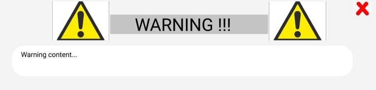

# Game Design

The following document outlines our proposed game design including: the flow and structure of the game, game mechanics. For the basic wireframes associated with the game interface, consult the [wireframes](#wireframes) at the end of this document.

## Global Definitions

Throughout the following sections, various terminology, with this definition table being a non-exhaustive reference point for a quick meaning of various terms.

|            Term | Definition                                                                              |
| --------------: | --------------------------------------------------------------------------------------- |
|    Emerald Mine | The retro game this design is conceptually referenced from                              |
|         Emerald | Reward system currency made up from emerald shards                                      |
| Emerald _shard_ | Reward system currency (smaller unit) that when combined make up an emerald             |
|          Player | A connected client that is actively playing                                             |
|       Spectator | A connected client that can only passively observe the game                             |
|       Moderator | A connected client that can oversee the game state                                      |
|         Ranking | A global leader-board of player account rewards                                         |
|            Team | A group of players that must collaborate to play the game                               |
|    Drawing team | A player group that has been tasked with sketching a word                               |
|   Guessing team | A player group that has been tasked with reaching consensus to guess a sketch           |
|          Sketch | A real-time 2D canvas that drawing players can use to sketch a word                     |
|            Word | A word or phrase to be drawn or guessed by a team                                       |
|           Guess | A word that is chosen by a team that represents their guess for the sketch              |
|           Level | A multiplier representing how many iterations of the mine a team has completed together |
|           Round | A single iteration of the sketching or guessing phase of the game                       |
|         Digging | The progression of a team through the level by accurately sketching or guessing         |
|     Game server | The central instance of the game logic server that players connect to                   |
|          ∞      | This means infinite                                                                     |

## Overview

Our proposed game is a web-based, collaborative, team based sketch guessing game. The game is Emerald Mine™ themed, and uses various elements from the game, but with a different style, interface and gameplay mechanics.
Teams work together to "dig" distance in a mine to receive emerald shards by guessing words based on sketches.

## Game parameters

| Name         | Max        | Minimum   |
| ------------ | ---------- | --------- |
| Server       | ∞ players  | 6 players |
| Team members | 3 players  | 3 players |
| Teams        | ∞ teams    | 3 teams   |
| Spectator    | ∞          | 0         |

---

## Teams

In the game, players are split into teams of 3 players, and depending on the game round, are tasked to either draw a word (the drawing team), or come up with a shared guess as to what the sketch represents (the guessing team).

Members of the teams may leave any time but once the team is no longer comprised of 3 players, the team is destroyed and other members can no longer continue. Therefore, as a team of 3 being a small number it is easier to communicate amongst each other and 
commit to each other that you can work well together as a team.

> Teams are based on a current game session, and are not persistent. They only exist for the indefinite lifecycle of the game

### Initial match making

A team of 3 is created once a randomly assigned team player is put in to the same team with 2 other players. A "Team matchmaking" message is displayed to the other 2 team members until a third member joins. Once a third member joins and there is another team of 3 ready a "Ready message" is displayed to signal the start of the game.

### Team composition

As defined, in the _Game parameters_, the maximum number of players in the game is ∞, but with a maximum of ∞ teams of 3 players each. The concrete composition of the game players is not strictly defined, as long as the total number of players, the number of active teams, and players within a team are within the mentioned bounds.

### Drawing team

#### Gameplay

In each round, one team must draw a given word for the other teams to guess. This specific team is randomly chosen at the start of every game round by the game server.

Once a team has been chosen to draw, a word is shown to the members of the team to draw. All team members can draw since they are only 3 members. Hence, all the team players can get a taste of drawing on the canvas. They can also communicate amongst each other on who can draw the word ofcourse by using the integrated team chat.

#### Balancing

In terms of balancing, if no guessing teams correctly guess the word based on the drawing, no digging distance is made for the drawing team. The more teams guess the word, the more "digging distance" is awarded to the drawing teams progression through the mine/level. This incentivizes the drawing team to accurately portray the given word in the sketch, and cuts down on spamming the canvas with unrelated information, as the team is directly rewarded for how well they can draw the word.

### Guessing team

#### Gameplay

In a guessing team, as soon as the sketching phase commences, the team will have to reach consensus on what word is being sketched within a certain timeframe. This guessed word must be agreed on by the majority of the teams members in order to be made as the teams final guess.

In order to arrive on a team guess, players in the team must first individually guess a word. This can be done either by initially writing the guess in the dedicated UI element, or by clicking an existing guess the team has made thus effectively changing the players guess.

All players in the team can see what their teams internal guesses are so far, together with how many people have "voted" for each guess. Players can also see what their teams final guess will be at any moment, and the amount of players still needed to reach consensus on the guess.

Once a guess is made majority, it is made final and submitted; the team can make no more guesses and have to wait for all other teams to submit their guesses or until the round time runs out.

In the case that a team does not agree on a word to guess (and the time runs out), the most commonly agreed guess is submitted instead. This is based on the final highest guessed word in terms of time, that the team has come up with.

When all the guessing teams have submitted a guess, or the timer runs out, answers from all teams as well as the results (correct solution, team rewards, etc.).

#### Round rewards

If a word is guessed correctly, a great amount of digging progress is awarded (plus multipliers). If the word is not guessed correctly, a small amount of progress is still given to make sure that the drawing team does not make the drawing unguessable.

## Levels

For progressing with your team, as soon as the end of the level/mine is reached, the team restarts with a higher level, increasing the rewards that they can obtain. Due to this, there is an endless amount of levels.

Levels are also only specific to a team, without influencing match making or the game itself. This mean that all the teams are in the same game, with each teams final level reward being different depending on their level.

Each level has a defined range of emeralds, and all emeralds must be collected in order to progress to the next level. Teams have to dig to the end of the tunnel to progress to finish the level and to keep all the emeralds they collected in that level.

Leaving the game mid-level will result in the player not keeping the emeralds the team has earned in that level. Once a level is completed, the team can keep the emeralds and they are placed back to the start with a new level indicator (counter). Players individually obtain this emerald reward, and their rankings are updated accordingly.

To progress, teams must dig the distance to reach the end of the level. During the digging, they can collect the emeralds that are placed at various progress points in the level.

### Player flow

The endless nature means that there is no end-game or defeat condition, and players can simply play for as long as they want to. Since rankings are persistent, players are also incentivized to return to the game to play additional levels.

### Rewards and penalties overview

To reward better gameplay by teams, there are digging distance bonuses/multipliers for teams based on how fast they locked in a correct guess. For the drawing team, the multiplier is based on how many teams were able to guess their sketch. Players are penalized for leaving the game without reaching the end of level (loosing all collected emeralds in that level).

The emerald shards you earn are multiplied by the "levels completed" counter, so in higher levels, teams can earn more emerald shards when reaching an emerald ore

> An emerald shard is a fraction of an emerald, whereas an emerald is a whole number of emerald shards.

## Moderator

Besides players, a moderator role is defined in the game, with this client being able to affect the state of the game.

### State influence

The moderator can send a warning message to a team as well as permanently ban a misbehaving player. Ofcourse this means making the whole team immediately stop playing since the team is disbanded when a player leaves the team. This is because there will be 2 players left which opposes the games team composition parameter. It is basically a blanket punishment to the whole team
which is unfortunate. 

## Spectators

A second non-player role is also used is also defined for spectating the game. Spectators can observe the game, and can see the sketch canvas, but not the word currently being drawn to avoid cheating. On top of this, anonymous spectators can't see the chat of other teams. Spectators can _not_ interact with the game in any way.

## Chatting

Communication is an integral part of the core game loop, therefore chat functionality is defined for teams to use. The chat log contains updates from the game state (what word your team should draw, the state of the game phase, etc).

For all teams, there is the option to send a message to other players in the team. This is used to communicate and allow the game to play the game.

No public chat is used, and teams can not communicate with players in other teams.

## Ranking

All players have their own persistent ranking, based on the number of emerald shards they have obtained while playing in teams. This ranking can be seen by anyone, displaying usernames and emeralds, but also their game performance statistics with metrics such as drawing accuracy.

## Wireframes

### Home screen

- the form appears on a white/black page, it's not all dirt
- font can be changed to a more similar one to the one in emerald mine
- login and signup can be moved to a previous screen if we don't allow people to play without being signed in
- make background with lower opacity (60-70%)

### Login

- basic login screen
- signup form looks the same (maybe with a confirmation password field)
- the form appears on a white/black page, it's not all dirt
- font can be changed to a more similar one to the one in emerald mine
- make background with lower opacity (60-70%)

### GUI

- adding more emerald mine elements
- adding more drawing tools
- separate the drawer, guesser and spectator view

### Ranking

- maybe fancier 1, 2 and 3 places
- copy how the emerald count looks in the GUI and maybe use that

### Rules

- a page with a "RULES" title and text underneath
- no dedicated wireframe

### Moderator

#### Moderator view of the canvas

- view of the moderator is similar to the player's view, but has an additional button such as:
  - the moderator can kick out a player and send them a warning (warning form below)
- the modal appears on top of the screen upon chosen moderator action
- behind the modal the view is similar to spectator one
- the modal depends on the chosen action that the moderator want to perform

#### Moderator warning message form

- The moderator can write out a private message (warning) to one of the players upon clicking the correct button
- The form shows in front of the view so the moderator can still spectate what is going on
- The <em>X</em> symbol closes the form without sending the message (if the moderator decides later that the warning is not needed) 

#### Player's view of the warning

- The player sees the warning content
- The player closes the warning by clicking the <em>X</em> symbol