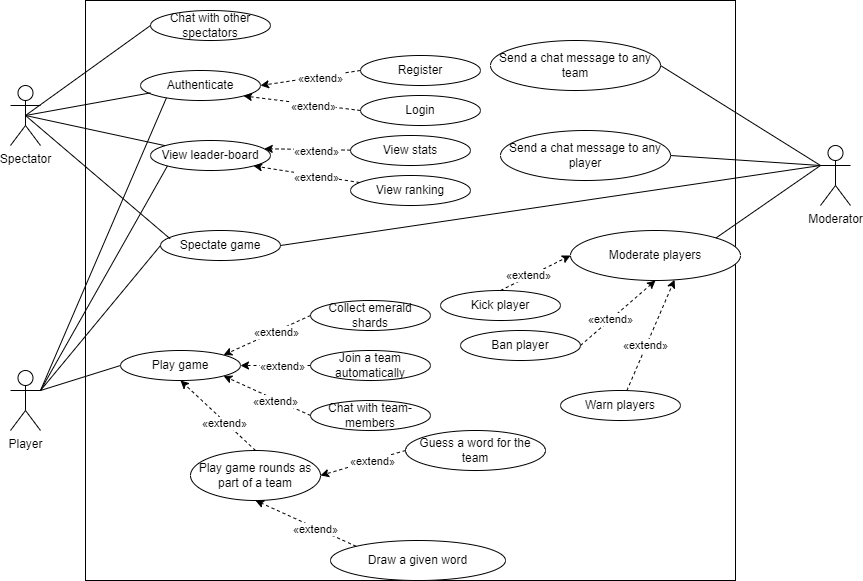

# System Document
---
##Functional design

###Goal
The purpose of the created product is entertainment, spending time competing with other people.
###Product

The presented product is a network game created for a large number of players who will be divided into teams.  Teams compete with each other to collect prizes.  This game does not have an ending, but it has difficulty levels, with each level the prize for completing the task increases.  The game consists in guessing the word made by one of the teams, using the image of this word in the form of a sketch as a clue.  The game also has a moderator who has a direct influence on the course of the game.

###Requirements

### Business requirements

| Requirement ID | Statement                                                               | MSCW   |
| -------------- | ----------------------------------------------------------------------- | ------ |
| B1             | Business wants to accumulate as many players as possible                | MUST   |
| B2             | Business wants to have a shopping system in the game                    | MUST   |
| B3             | Business wants the system to display a players statistics               | MUST   |
| B4             | Business wants the game to have an emerald mine theme                   | MUST   |
| B5             | Business wants to spend as little money as possible to produce the game | SHOULD |

### User requirements

#### Player user

| Requirement ID | Statement                                                            | MSCW  |
| -------------- | -------------------------------------------------------------------- | ----- |
| U1             | User can view another players statistics                             | MUST  |
| U2             | User can view their rank in the leaderboard                          | MUST  |
| U3             | User can get into an active session match                            | MUST  |
| U4             | User can draw on the canvas in the game                              | MUST  |
| U5             | User can get help on how to play the game                            | MUST  |
| U6             | User can submit a guess                                              | MUST  |
| U7             | User can chat with other players in the same team                    | MUST  |
| U8             | User can buy power ups and buffs using the emeralds they accumulated | MUST  |
| U9             | User can leave an active session match                               | MUST  |
| U10            | User can play the game on their mobile device                        | COULD |

#### Moderator user

| Requirement ID | Statement                                | MSCW   |
| -------------- | ---------------------------------------- | ------ |
| MU1            | User can influence the game logic        | MUST   |
| MU2            | User can chat with all the other players | MUST   |
| MU3            | User can kick out a player               | SHOULD |
| MU4            | User can permanently ban a player        | COULD  |

#### Spectator user

| Requirement ID | Statement                                       | MSCW  |
| -------------- | ----------------------------------------------- | ----- |
| SpU1           | User can enter an active session match to watch | MUST  |
| SpU2           | User can chat with another spectator            | WOULD |

### System requirements

#### Functional requirements
| Requirement ID | Statement                                                                         | MSCW   |
| -------------- | --------------------------------------------------------------------------------- | ------ |
| SF1            | System can evenly distribute players between teams before and during the match    | MUST   |
| SF2            | System can send messages between players in the same team                         | MUST   |
| SF3            | System can support drawing on a canvas                                            | MUST   |
| SF4            | System can give each player a score                                               | MUST   |
| SF5            | System can show a drawing in realtime                                             | MUST   |
| SF6            | System can show a team their guesses in realtime                                  | MUST   |
| SF7            | System can display a specific players rank score                                  | MUST   |
| SF8            | System can display all the teams level progress in realtime                       | MUST   |
| SF9            | System can give the drawing team a description of what to draw                    | MUST   |
| SF10           | System can allow only moderators to kick out players                              | MUST   |
| SF11           | System can allow a player to leave an active match                                | MUST   |
| SF12           | System can display the game rules to a player                                     | MUST   |
| SF13           | System can time a round of drawing and guessing                                   | MUST   |
| SF14           | System can display the players statistics such as accuracy and average guess time | MUST   |
| SF15           | System can allow only moderators to influence the game logic                      | SHOULD |
| SF16           | System can allow only moderators to permanently ban a player                      | COULD  |

#### Non functional requirements
| Requirement ID | Statement                                           | MSCW  |
| -------------- | --------------------------------------------------- | ----- |
| SNF1           | System can be available and run 24/7                | MUST  |
| SNF2           | System can securely log in a player                 | MUST  |
| SNF3           | System can run on a web browser                     | MUST  |
| SNF4           | System can handle up to 99 players per match        | MUST  |
| SNF5           | System can handle an unlimited number of spectators | MUST  |
| SNF6           | System can run on a mobile device                   | COULD |

---
###Interface

#### Description of a graphical representation of interaction with a WebApplication.

####Use case diagrams consist of 2 objects:
1. Player
2. Moderator

#### Player capabilities:
- Whenever player opens the web application and select the role of a participant in the game if the game has not yet started or if the first round of this game is in progress.
- The player than must register to participate or log into a previously registered account.
- The player can be just a spectator, then he just watches the game process, without the ability to somehow influence it.
- Next when the player has chosen the role of the player, he joins the team automatically.
- When the game began, the progress towards the victory of the Player is indicated by the number of emeralds collected,when a word is guessed from your drawing by the player's team or when a word is guessed from your drawing under the required conditions.
- Afterwords, player can see the progress and rating of the players.
- During the game, the player communicates via chat with his team, discussing options for solving the puzzle.
- The game is divided into several rounds, in each round, the players of the team will guess the drawn image through voting and chat discussions, another role during the game is when your team has to draw the image for other teams to guess it

#####Purpose of moderator: The goal of the moderator is to monitor and control the correct course of the game.

####Moderator capabilities:
- The moderator's capabilities include private chat with the whole team, as well as with an individual team member.
- The moderator can kick any player out of the game, as well as completely ban the player's account.
- Moderator options include making the game harder or easier for the players.

##Technical design
### Development tools

For Sprint 1 to start developing the game, we decided to use Svelte, Tailwind CSS for the client. For the server, we are going to use Node.js, Express, Socket.IO, and PostgreSQL. The server will store player data, and distribute the game state to connected clients.

###Tools used for development:

|Programming Languages       | Tooling/IDE       | 
| ------------- |:-------------:| 
| Javascript      |Svelte for IDE, Canvas API | 
| HTML     | Svelte for IDE ,Canvas API    |  
| CSS|   Tailwind CSS    |  

###Tools used for application:
|Tool/ Application/Module      | Purpose|      
| ------------- |:-------------:| 
| Svelte      |For developing fast JavaScript Web Application |
| Node.js    | using JavaScript to start both the frontend and backend of web apps | 
| Express.js | By configuring routes for your application, Express. js makes it simple to create a web server and render HTML pages for various HTTP requests.| 
|Socket.IO| library for realtime web applications|
|PostgreSQL|open-source relational database management system |
|Visual Studio Code|All team members will use Visual Studio Code as the primary editor for the project|
## Communication protocols
Since is going to be an online game the protocols we are going to use WebSockets and HTTP. HTTP over a REST API will be used for interacting with the game and dispatching certain actions like logging in, joining a game, etc. HTTP will also be used to serve the client Svelte frontend. Socket.IO over WebSockets will be used between the server and client to receive game updates. For the database, we are going to use the SQL protocol to query and store persistent information.

---

## Road-map

| Sprint nr | Start      | End        | Main aim                                                                                                                                                                                                                             | User stories                 |
| --------- | ---------- | ---------- | ------------------------------------------------------------------------------------------------------------------------------------------------------------------------------------------------------------------------------------ | ---------------------------- |
| 0         | 07/02/2022 | 13/02/2022 | Come up with a game idea, subdivide team into smaller groups, make pitch presentation for the publisher, write initial docs, plan Sprint 1                                                                                           | –                            |
| 1         | 14/02/2022 | 06/03/2022 | Basic user (web) interface, main parts of our game (canvas, buttons, chat, group listings, ranking, various pages such as the login page, etc.), Basic UI functionality (Sketching on the canvas, Word guessing, Basic chat system ) | 3, 4, 5                      |
| 2         | 07/03/2022 | 20/03/2022 | Implement database, level progression system, user accounts, moderation, spectating                                                                                                                                                  | 1, 2, 6, 7, 8, 9, 10, 11, 12 |
| 3         | 21/03/2022 | 10/04/2022 | Polishing the game, fixing game bugs, improving features                                                                                                                                                                             | TBA                          |