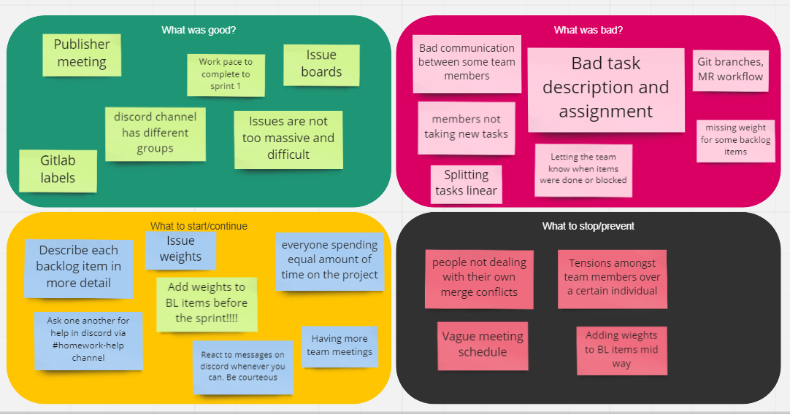
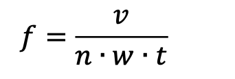

# Team Plan

---

## Roles

### Team Roles

The whole team is divided into 2 groups. Each group has an ambassador and a scrum master.

We have a few roles that are responsible for different aspects of the teams.
Certain roles will be swapped within the team for the following sprints.
Below is an overview of the role description and who is responsible.

### Groups

**Group 1**

- Craig Chauraya
- Vincenzo Savarase
- Ana Kareco
- Mira Ilieva
- Melissa Neamt-Jilovan
- Daria Grigoruk

**Group 2**

- Philippos Slicher
- Lukman Sulaiman Al-Busaidi
- Marko Špišic
- Peter Pinter
- Vedat Daglar

### Roles

#### Git Maintainer

- Responsible: Philippos Slicher

The Git Maintainer keeps track of the team repository. Their goal is to keep
the repo clean and organized.

#### VPS Responsible

- Responsible: Philippos Slicher

As the project will be running on a virtual private server, there must be
someone who is responsible for the connection of the VPS and the project itself
therefore we have a role dedicated to this issue.

#### Head Ambassador

- Responsible: Peter Pinter

The purpose of the ambassador is to handle the two groups ambassadors and maintain the progress of the team.

#### Scrum Masters

- Group-1 Scrum Master (Sprint 1): Craig Chauraya
- Group-2 Scrum Master (Sprint 1): Vedat Daglar
- Group-1 Scrum Master (Sprint 2): Mira Ilieva
- Group-2 Scrum Master (Sprint 2): Lukman Sulaiman Al-Busaidi

The scrum masters keep track of the issues/tasks given for the following stand-up meeting.

#### Group Ambassadors

- Group-1 Ambassador (Sprint 1): Vincenzo Savarese
- Group-2 Ambassador (Sprint 1): Vedat Daglar
- Group-1 Ambassador (Sprint 2): Melissa Neamt-Jilovan
- Group-2 Ambassador (Sprint 2): Philippos Slicher

The group ambassadors are responsible for communication with the other teams' ambassador.
They also inform the head ambassador of the progress within the team.

---

## Code of Conduct

### Article 1 - Acceptance of Code of Conduct and new versions

_§1_ All team members, who are considered as members of this team (team no. 2) by the official Excel sheet of the group members list agree to this code of conduct automatically and declare they are aware of said rules and accept them.

_§2_ Upon publishing the code of conduct to the team's repository (GitLab), the committer of the document containing the code of conduct must inform all team members about the existence of the code of conduct within 24 hours of publication. Written proof must be present of this.

_§3_ Once the document containing the code of conduct is published, all team members must read the code of conduct within 72 hours (3 days). Once 72 hours passed, all team members, who have been informed by the code of conduct's publisher (with written proof) are considered to have read and accepted the code of conduct, considering no objections have been raised.

_§4_ Once a team member is notified about of the publication of a version of the code of conduct, team members must decline articles and/or individual paragraphs within 72 hours after the publication of the code of conduct. If a team member declines the publication of the code of conduct, they must act under the definition of paragraph 6. If no reaction is made, or they do not act under paragraph 6, that means the team member accepts the code of conduct.

_§5_ Once the first version of the code of conduct is published, changes to the code of conduct may be made. A new version to the code of conduct may only be made after 120 hours passed of the last version's publication. Once 120 hours passed, a new version may be published under the same procedure describe in Article 1, paragraph 1 to 4.

_§6_ If a team member decides not to agree with a section of the newly published code of conduct, they must inform all team members about the section they are not in agreement with. In this case, within 48 hours, all team members must agree on a change. If this does not happen, the original version will stay in act.

### Article 2 - Strike definition

_§1_ A team member may be given a maximum of 3 strikes. Upon receiving the third strike, under the definition of the manual, the team member is removed from the team.

_§2_ A strike may be issued to any team member once they do not follow any point the code of conduct, however, issuing a strike is not mandatory. A strike can only be issued if the majority of the team agrees to issue the strike. There must be written proof of said agreement.

### Article 3 - Communication rules

_§1_ The online (long distance) communication between team members is to be performed using the shared group server in Discord. Thus, all team members must have a free account registered on Discord. Said software must be installed both on everyone's main working computer and on their personal mobile phones. Notifications must also be enabled for at least the group server to make sure team-members are aware of new messages from other team-members. This is to ensure proper team communication and to make sure that all team-members are aware of new meetings, tasks and other important information regarding the project.

_§2_ Whenever an important decision is made, or a request is made, a written proof must be made of said act that all team members can see.

_§3_ If a meeting is planned (online or physical), the meeting must be planned at least 48 hours of the planned event date. All team members must be informed about the planned meeting. Once planning is made in said manner, everyone, who doesn't give within 24 hours an expectable written reason to be absent, must be present in the meeting (online or physical). If a team member doesn't react to a meeting plan within the given time, they are considered to be aware of the meeting, and they shall therefore attend it.

_§4_ If a team member is not able to attend physical meetings due to lockdown, quarantine or if said person is abroad for an extended period of time, they then--if appropriate conditions (internet, well being, etc.) are met--must attend the physical meetings online.

### Article 4 - Work agreements

_§1_ Every team member's work must be uploaded to the team's GitLab repository. The only exception applies to the time sheet (Excel document) which is located in a shared One Drive folder.

_§2_ Every written document, that is not code, must be written in Markdown format (.md file).

_§3_ Every team member is responsible to solve merge conflicts themselves. It is neither the SCRUM master's nor the branch merger's task to solve merge conflicts. Whenever a merge conflict occurs, the one, who wrote the original code that is now causing the merge conflict, must solve the issue.

_§4_ Team members must implement their SCRUM backlog items in a separate branch and rebase their branch on the current master branch when it is ready to be reviewed and merged. Nobody is allowed to work on the master branch, as it is protected.

_§5_ Each team member must push their functioning commits to the git repository at least 1 hour before the agreed and announced deadline. If a team member is unable to finish their task in time, they must at least publish a subset of the work, indicating the status. This work must still be pushed to the upstream repository, so others can use said work.

_§6_ If a team member is "hard stuck" (cannot progress anymore alone with their task), they must ask help from others. Simply not completing their tasks is unacceptable. They must inform the team about this situation 12 hours before the agreed and announced deadline for their work.

_§7_ Whenever a team member has done any work (either alone or together with someone else) that is related to the project, they must record their working time on the team's time sheet.

_§8_ Once an announced meeting happens (online or physical), that is planned 24 hours prior (in other words, it is not an ad-hoc meeting) and no notice was provided 12 hours prior the meeting about being late, a team member is considered to be absent after being late by 15 minutes.

_§9_ Whenever a team member produces any work, it must be usable work by other team members. Usable work is defined as work that is generally complete, clear and interpretable by other team members.

_§10_ Deadlines for work and scheduled group meetings must be announced 24 hours before the actual deadline. Said announcements must be written down. The announcer must make sure everyone knows the deadline. Agreements must be made if said deadline is not suitable for a team member.

_§11_ Whenever someone has done any work, whether code or documentation related, they must inform all team members in any way that their work is completed.

_§12_ In git commit messages, the author must give a basic description about the changes that their commit contains. Commit messages must be 'semantic', prefixed with keywords such as "chore", "feature", "fix".

_§13_ In git, branches must follow the 'git flow' naming convention, and track referenced issues from the Gitlab issue board.

_§14_ In git, all branches must be automatically created from the issue board, and linked to their issue and associated merge request. Team members should not manually create arbitrary branches.

---

## Process artifacts

### User stories

1. As a system admin, I want the user to be able to sign up and sign in, so that the progress is saved to their account.

2. As a player, I want to be able to see the players' statistics, so that I can compare myself to other players.

3. As a player, I want to be able to draw on a canvas, so that the teams can guess my word.

4. As a player, I want to be able to submit my guess, so that I can get more emeralds.

5. As a player, I want a chat functionality, so I can communicate with my teammates.

6. As a player, I want the game to be mobile responsive, so that I can play it on my mobile phone.

7. As a player, I want the ability to leave an ongoing game, so that I am not forced to play.

8. As a moderator, I want to remove players from an ongoing game, so that there is no inappropriate behavior.

9. As a moderator, I want to buff or debuff teams, so that I can influence the game logic.

10. As a user, I want to be able to spectate, so that I can watch an ongoing game.

11. As a player, I want to get emeralds, so that I can purchase powerups with the gained emeralds.

12. As a moderator, I want to have a means of communicating with the players, so that I can give them warnings.

---

### Backlog items

#### US01 - As a system admin, I want the user to be able to sign up and sign in, so that the progress is saved to their account

##### US01 BI01

Login page component

##### US01 BI02

Sign up page component

##### US01 BI03

Login functionality

##### US01 BI04

Sign up functionality

##### US01 BI05

Routing

##### US01 BI06

Home screen component

#### US01 - As a player, I want to be able tto see the players' statistics, so that I can compare myself to other players

##### US02 BI01

Ranking page component

#### US03 - As a player, I want to be able to draw on a canvas, so that the teams can guess my word.

##### US03 BI01

Create canvas component

##### US03 BI02

Create separate roles for drawing and viewing canvas

##### US03 BI03

Create drawing tools (e.g. colours) selection

##### US03 BI04

Create websocket for transferring canvas content between drawer and server

##### US03 BI05

Create a save of the canvas content for sending to users that connected later on

##### US03 BI06

Create the logic for the canvas

#### US04 - As a player, I want to be able to submit my guess, so that I can get more emeralds.

##### US04 BI01

Create guess section where guesses will be submitted

##### US04 BI02

Ability to pick a guess from the guess list

##### US04 BI03

See top picks guess in a certain team

##### US04 BI04

Get emeralds when the guess is correct

##### US04 BI05

Create a progress bar to see where the team is currently at

##### US04 BI06

Multiply the gained emeralds when a new level is reached

##### US04 Bl07

Add the functionality to the progress bar

##### US04 Bl08

Create guess backend

#### US05 - As a player, I want a chat functionality, so I can communicate with my teammates.

##### US05 BI01

Create chat component

##### US05 BI02

Connect frontend incoming chat to the backend

##### US05 BI03

Establish socket.io server

##### US05 BI04

Add chat backend functionality

##### US05 BI05

Connect frontend outgoing chat to the backend

##### US05 BI06

Add team based chat scopes in the backend

##### US05 BI07

Add team list component

##### US05 BI08

Connect team listing component with backend

##### US05 BI09

Make team based chat

#### US11 - As a player, I want to get emeralds, so that I can purchase powerups with the gained emeralds.

##### US11 Bl01

Create the database and the database schema

##### US11 Bl02

Handling team stats in the backend so that each level, emeralds are distributed among team members

##### US11 Bl03

Send updates to the frontend about team progression from the backend.

##### US11 Bl04

Reset the progress of the finished team to the begining when they reach the end of the progress.

##### US11 Bl05

Store the digging distance for each team in the backend

##### US11 Bl06

Pick a word from the word list in the databse and send it to the frontend

##### US11 Bl07

Send results of the round to the frontend to display the teams that guseed the word correclty or not.

##### US11 Bl08

Define the progress that the team should progress in each round in the backend.

##### US11 Bl09

Matchmaking ui in the frontend

##### US11 Bl10

Matchmaking system in the backend

##### US11 Bl11

Create the voting system.

#### US07 - As a player, I want the ability to leave an ongoing game, so that I am not forced to play.
##### US07 Bl01

Creating Screen for the user when they successfully leave the game

##### US07 Bl02

Player is removed from the team with saved progress

#### US08 - As a moderator, I want to remove players from an ongoing game, so that there is no inappropriate behavior.

#####  US08 Bl01

Handle the ability to assign moderator role to a specific user

##### US08 Bl02

Create the moderator screen/view of the game

##### US08 Bl03

Create the functionality to remove another player from their team as a moderator

#### US10 As a user, I want to be able to spectate, so that I can watch an ongoing game.

##### US10 Bl01

Create the ability to assign spectator role to myself as a user

##### US10 Bl02

Create the spectator view of the game

##### US10 Bl03

Remove the user from the team if he/she wants to be a spectator

---

## Budget

- Available hours per person per week: **12 hours**
- Euros required per person per hour: **50€**

### Budget breakdown

| Definition               | Cost (€) |
| ------------------------ | -------- |
| Work per person per week | 600      |
| Total cost per week      | 6'600    |
| Sprint 0                 | 6'600    |
| Sprint 1                 | 13'200   |
| Sprint 2                 | 13,200   |
| Sprint 3                 | 19,800   |
| Project total            | 52,800   |

> 12 EUR 11 _(developers)_ 50 _(hourly rate)_ \* 8 _(weeks)_ = _52'800 EUR_

---

## Sprint retrospectives

### Sprint 0

#### What accelerated us

- Clear plan on who has to do what
- Having a todo list
- Issues on gitlab (with labels, assigned members, etc)
- Working in only one environment (GitLab)
- Visual Studio Code live share (pair "programming")
- Having a game idea that doesn't rely on a game engine
- Having everyone in our Discord group so we can all communicate easily with each other

#### What slowed us down

- Communication
- Agreeing on game specifics
- Not everyone read the manual
- Enforcing standardized usage of git (commit messages, branches, issues, etc)
- Onboarding new members, who weren't there during the original planning phase

#### Future plans

- Having organized and scheduled meetings as agreed by the team
- Familiarizing everyone with the standard git rules
- Having a celebratory meeting after every sprint to boost the moral of the team, e.g lunch, mangoes and drinks
- Being more specific on deadlines and meeting times
- Clearly working in our defined sub-groups instead of as one large group (individual scrum masters, ambassadors, etc)
- Making tasks clearly explained to follow a uniform standard as agreed byn everyone in the team

#### Costs:

- Sprint 0 total time spent: *125.71 hours*
- Sprint 0 estimated costs: *6'600€*
- Sprint 0 actual costs: *6'285.5€*

### Sprint 1

#### Focus factor:
𝑓 = 𝑓𝑜𝑐𝑢𝑠 𝑓𝑎𝑐𝑡𝑜𝑟

𝑡 = 𝑎𝑣𝑎𝑖𝑙𝑎𝑏𝑙𝑒 h𝑜𝑢𝑟𝑠 𝑝𝑒𝑟 𝑤𝑒𝑒𝑘 𝑝𝑒𝑟 𝑝𝑒𝑟𝑠𝑜𝑛 (12)

𝑛 = 𝑛𝑢𝑚𝑏𝑒𝑟 𝑜𝑓 𝑡𝑒𝑎𝑚 𝑚𝑒𝑚𝑏𝑒𝑟𝑠 (11)

𝑤 = 𝑛𝑢𝑚𝑏𝑒𝑟 𝑜𝑓 𝑤𝑒𝑒𝑘𝑠 𝑓𝑜𝑟 𝑎 𝑆𝑝𝑟𝑖𝑛𝑡 (2)

𝑣 = 𝑆𝑢𝑚 𝑤𝑒𝑖𝑔h𝑡 𝑜𝑓 𝑏𝑎𝑐𝑘𝑙𝑜𝑔 𝑖𝑡𝑒𝑚 (221)

> Focus factor this sprint: **0.83712**

#### Costs:

- Sprint 1 total time spent: *177.41 hours*
- Sprint 1 estimated costs: *13'200€*
- Sprint 1 actual costs: *8'870.5€*

---

## Communication methods

### Introduction

To successfully complete this complex project, team members must communicate effectively. This section of the documentDone describes the ways and general plan for team communication, as well as the tools used for this.

---

### Communication plan

The following is an overview for how the team will communicate internally, as well as with stakeholders.

| Communication     |         Audience          |                                                                                                           Goals |                            Schedule |
| ----------------- | :-----------------------: | --------------------------------------------------------------------------------------------------------------: | ----------------------------------: |
| Kick-off meeting  | Project team, stakeholder |                                                      Set expectations, introduce the project to the stakeholder |                    Start of project |
| Sprint planning   |       Project team        |                                                        Establish the backlog and objectives for the next sprint |                     Start of sprint |
| Standup           |     Project subgroup      | Share members progress, addressing further action for blocked issues. Assign items from the backlog to members. |           At least 2 times per week |
| Group brief       |    Project ambassadors    |           Share the groups progress, with an overview of the state of the group according to the global sprint. | At least once a week, and as needed |
| Sprint review     |       Project team        |                                                           Validate sprint, reflect on project and team progress |                       End of sprint |
| Publisher meeting | Project team, stakeholder |                                                        Present current deliverables, update on product progress |                       End of sprint |

#### Schedule

|          | Sprint planning | Sprint review | Standups                    | Publisher meeting |
| -------- | --------------- | ------------- | --------------------------- | ----------------- |
| Sprint 1 | 14.02.2022      | 07.03.2022    | Monday, Friday (every week) | 07.03.2022        |
| Sprint 2 | 07.03.2022      | –             | Monday, Friday (every week) | –                 |

#### Communication tools

For communicating and sharing information with other project members, the following tools are to be used:

- Discord - A common server is used for voice/video calls, screensharing and pair programming, as well as the primary chat tool and permanent record of all team communication. Members in the server are labelled with the role of the sub-group they belong to. Multiple channels are available for members to use depending on the context necessary.
- OneDrive - A shared OneDrive folder is used to grant access to the shared timesheet for all project members to log their tracked project time.
- GitLab - The issue board is used as the single source of truth of assigned items and project state. Issues and merge requests are assigned to discrete project members, with the possibility for members to leave review notes, and manage active items. GitLab is also the central store for _all_ project documentation (in markdown format).
- Email - Used to formally communicate with the publisher and other stakeholders
- Physical meetings - Used for standups, and publisher presentations.
