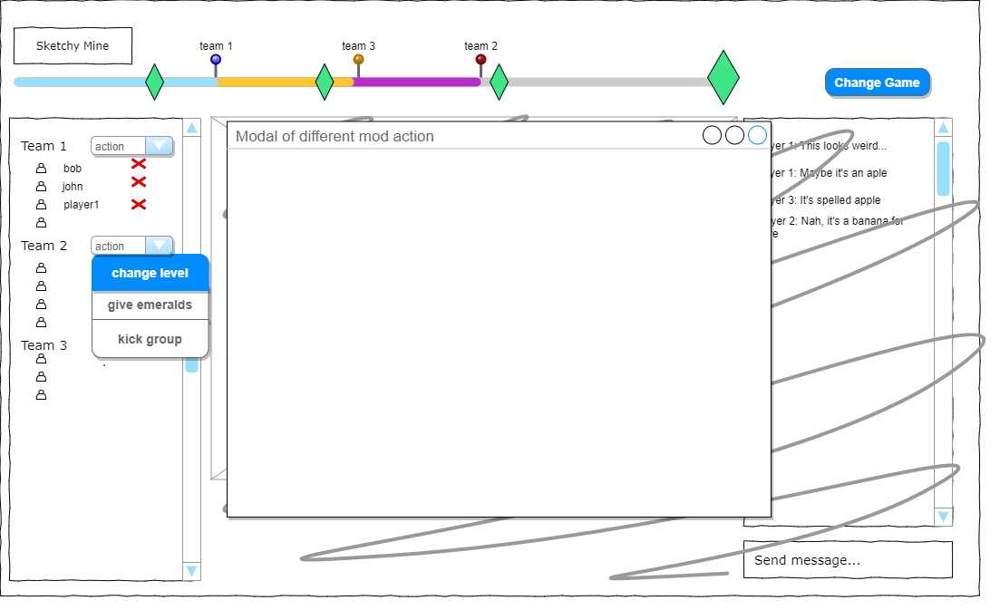

#Wireframes

##Home screen

- the form appears onn a white/black page, it's not all dirt
- font can be changed to a more similar one to the one in emerald mine
- login and signup can be moved to a previous screen if we don't allow people top play without being singed in
- make background with lower opacity (60-70%)

##Login

- your basic login screen
- signup form looks the same (maybe with a confirmation password field)
- the form appears onn a white/black page, it's not all dirt
- font can be changed to a more similar one to the one in emerald mine
- make background with lower opacity (60-70%)

##GUI

- adding more emerald mine elements
- adding more drawing tools
- separate the drawer, guesser and spectator view

##Ranking

- maybe fancier 1, 2 and 3 places
- copy how the emerald count looks in the GUI and maybe use that

##Rules
- literally just a page with a "RULES" title and text underneath 
- does that really need a wireframe?
- or explanation?

##Moderator

- the modal appears on top of the screen upon chosen moderator action
- behind the modal the view is similar to spectator one
- the modal depends on the chosen action that the moderator want to preform  